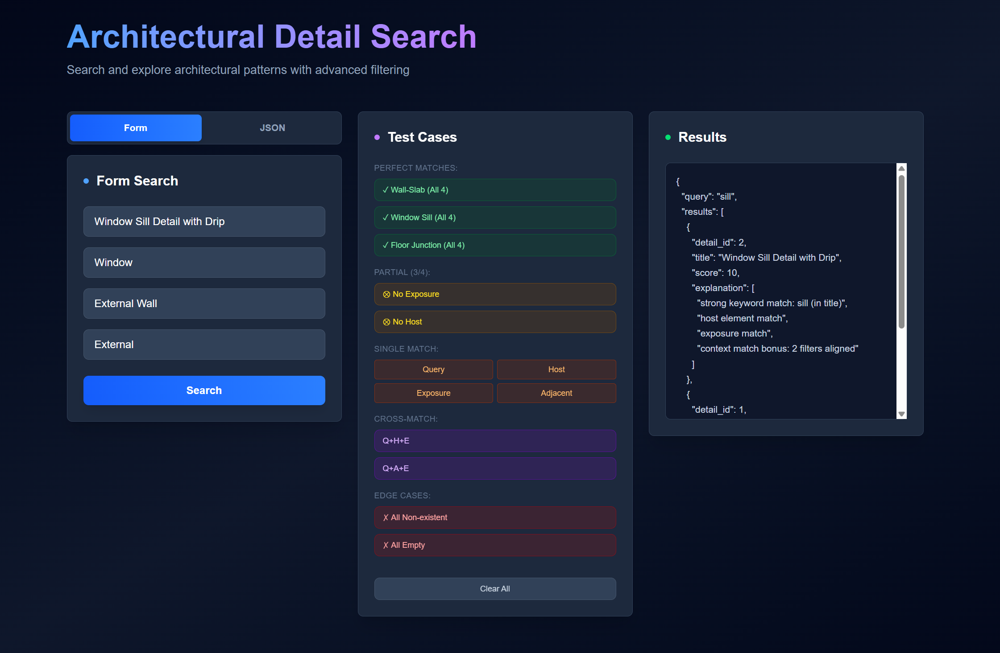

# Architecture Detail Search Engine

A context-aware search system for discovering architectural construction details based on **text queries and contextual filters**.

The system ranks results using a **multi-signal scoring algorithm** combining keyword relevance and contextual alignment.

---

# Tech Stack

- **Backend:** FastAPI (Python)
- **Frontend:** Next.js (React + TypeScript)
- **API:** REST
- **Storage:** In-memory data structures (as required by assignment)

---

# System Architecture

```
User
  │
Next.js UI
  │
FastAPI API
  │
Search Engine
  │
Architectural Detail Library (in memory)
```

---

# Setup Instructions

## Clone Repository

```bash
git clone https://github.com/yolo-pranav/architecture-search-engine.git
cd architecture-search-engine
```

---

# Backend Setup

Navigate to backend folder:

```bash
cd backend
```

Install dependencies:

```bash
pip install -r requirements.txt
```

Run server:

```bash
cd ..
uvicorn backend.app:app --reload
```

Backend will run at:

```
http://localhost:8000
```

API documentation available at:

```
http://localhost:8000/docs
```

---

# Frontend Setup

Navigate to frontend folder:

```bash
cd frontend
```

Install dependencies:

```bash
npm install
```

Run development server:

```bash
npm run dev
```

Frontend will run at:

```
http://localhost:3000
```

---

# Example API Request

Endpoint:

```
POST /search
```

Example request:

```json
{
  "query": "wall junction waterproof",
  "host_element": "External Wall",
  "adjacent_element": "Slab",
  "exposure": "External"
}
```

---

# Example API Response

```json
{
  "query": "wall junction waterproof",
  "results": [
    {
      "detail_id": 1,
      "title": "External Wall - Slab Junction",
      "score": 14.0,
      "explanation": [
        "strong keyword match: wall (in title)",
        "strong keyword match: junction (in title)",
        "keyword match: waterproof",
        "multi-keyword bonus: 3 keywords matched",
        "host element match",
        "adjacent element match",
        "exposure match",
        "context match bonus: 3 filters aligned"
      ]
    }
  ]
}
```

---

# Scoring Logic

The search engine ranks results using a **multi-factor scoring system**.

### 1. Keyword Matching

Each query word is matched against searchable text (title, tags, description).

| Match Type | Score |
|------------|------|
| Keyword appears in title | +3 |
| Keyword appears in description/tags | +1.5 |

---

### 2. Multi-Keyword Bonus

If multiple query keywords match the detail:

```
score += number_of_matches * 0.5
```

This rewards documents that match more query terms.

---

### 3. Context Matching

Context filters strongly influence ranking.

| Context Match | Score |
|---------------|------|
| Host element match | +3 |
| Adjacent element match | +3 |
| Exposure match | +2 |

---

### 4. Context Alignment Bonus

If multiple contextual filters match:

```
if context_matches >= 2:
    score += 2
```

This boosts results that align with multiple contextual constraints.

---

# Search Workflow

1. User submits query and optional context filters
2. Query keywords are extracted
3. Each architectural detail is evaluated:
   - keyword relevance
   - title matches
   - contextual alignment
4. Scores are computed
5. Results are sorted by relevance score
6. Top 5 results are returned with explanations

---

# Engineering Questions

## 1. If this system needed to support 100,000+ details, what changes would you make?

- Store architectural details in a **PostgreSQL database with indexed schema** instead of in-memory objects to enable scalable querying.  
- Introduce a **vector database (FAISS, Pinecone, or Weaviate)** to support semantic similarity search using embeddings.  
- Implement **hybrid retrieval (keyword search + vector search)** with caching and pagination to efficiently handle large query volumes.

---

## 2. What improvements would you make to the search or ranking logic in a production system?

- Use **BM25 or TF-IDF ranking with field weighting** so matches in titles, tags, and descriptions have different importance.  
- Add **semantic search using embeddings** to match conceptually similar architectural terms.  
- Apply **learning-to-rank models** that adjust scoring dynamically based on historical search performance.

---

## 3. What additional data or signals could help improve recommendation quality?

- Use **user interaction signals** such as clicks, frequently viewed details, and previously selected construction details.  
- Incorporate **project metadata** like building type, material system, and climate zone.  
- Use **relationships between construction details** (e.g., wall–window–slab assemblies) to recommend related architectural details.

---

## 4. If this API became a shared service used by multiple applications, what changes would you make to its architecture?

- Add an **API gateway with authentication and rate limiting** to securely manage requests from multiple client applications.  
- Design **clear routing for different request types** (search, recommendations, metadata queries) and provide well-documented APIs for easier integration.  
- Use **data sharding and regional deployments** to distribute architectural detail data across regions and reduce latency for global users.

---

## 5. What would you change if this system needed to support AI-based recommendations in the future?

- Generate **vector embeddings for architectural details** and store them in a vector database to enable semantic similarity search.  
- Implement **hybrid retrieval (keyword search + vector search)** and retrieval-augmented generation (RAG) to improve search and provide contextual explanations.  
- Build an **AI recommendation layer** that suggests related architectural details using similarity, design relationships, and historical usage patterns.

---

# Project Structure

```
architecture-search-engine

backend/
    app.py
    search_engine.py
    search_utils.py
    data.py

frontend/
    app/
    components/

README.md
```

---

# Key Features

- Context-aware search
- Explainable ranking results
- Interactive UI
- JSON and form query support
- Top-N ranked results

---

# Demo UI



The frontend provides:

- query input fields
- contextual filter inputs
- JSON request mode
- built-in test cases
- ranked result visualization

---

# Summary

This project demonstrates:

- search system design
- ranking algorithm implementation
- REST API development
- frontend-backend integration

while maintaining simplicity appropriate for the assignment requirements.